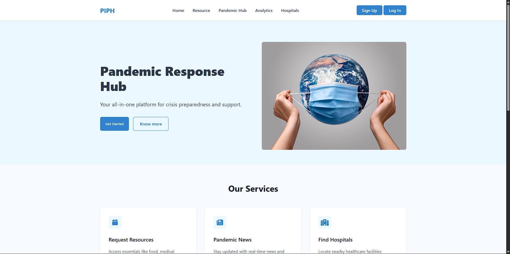

#  Pandemic Insights and Preparedness Hub (PIPH)

A comprehensive, real-time platform built to enhance emergency response, resource coordination, and pandemic data analysis. PIPH empowers individuals, organizations, and government agencies to make informed decisions and deliver timely help during pandemics or disaster situations.

🌐 **Live Site**: [Visit PIPH](https://pandemic-insights-and-prepareness-hub-piph-rmk7.vercel.app/)  
📂 **GitHub Repository**: [View Code on GitHub](https://github.com/Satyam12x/Pandemic-Insights-and-Preparedness-Hub-PIPH-)

---

## 📸 Preview

 <!-- Replace with actual image link -->

---

## 📌 Key Features

### ✅ Comprehensive Real-Time Platform
- Integrates live pandemic data, dynamic resource tracking, and historical records for better decision-making.

### 🚨 Emergency Alert System
- Automatically alerts the **three nearest hospitals** in case of user emergencies.
- If no response is received in **3–5 minutes**, the system escalates alerts to **up to 10 hospitals**.

### 🤝 Helper Role Feature
- Users can volunteer as **helpers**.
- During emergencies, alerts are also sent to nearby available helpers.

### 📊 Multi-Dashboard Interface
- **Pandemic Analysis Dashboard**: Tracks real-time statistics, trends, and transmission data.
- **Resource Management Dashboard**: Monitors availability and logistics of essentials.
- **Economic & Resource Dashboard**: Analyzes economic impact and resource allocation patterns.

### 🧑‍💼 Admin & User Panels
- Admin dashboard for request management, analytics, and verification.
- User portal for aid requests, volunteering, and monitoring their activities.

### 🛠️ Resource Request Functionality
- Users can request **food, shelter, or medical help**.
- Requests are routed to the nearest **NGOs, government agencies, or disaster relief centers**.
- Admins can **accept or reject** requests after review.

### 🏥 NGO & Disaster Relief Directory
- Dedicated page listing verified **NGOs and relief organizations**.
- Users can donate to support verified causes directly from the platform.

### 📝 Organization Registration
- NGOs can register via a dedicated form.
- Government officials handle verification and approval of organizations.

---

## 🧾 Project Structure
```bash
PIPH/
│
├── backend/                # Node.js backend for APIs and database
│   ├── controllers/        # Business logic and request handlers
│   ├── models/             # MongoDB schemas and data models
│   ├── routes/             # Express route handlers
│   ├── utils/              # Middleware, token helpers, etc.
│   └── server.js           # Backend entry point
│
├── frontend/               # React frontend app
│   ├── assets/             # Static images and icons
│   ├── components/         # Reusable UI components
│   ├── pages/              # Individual page components (Home, Dashboards)
│   ├── styles/             # CSS and style files
│   ├── App.js              # App root
│   └── index.js            # Entry file
│
├── config/                 # Config files (DB, API keys)
├── .env                    # Environment variables
├── .gitignore              # Git ignored files
├── package.json            # Project dependencies and scripts
└── README.md               # Project documentation
